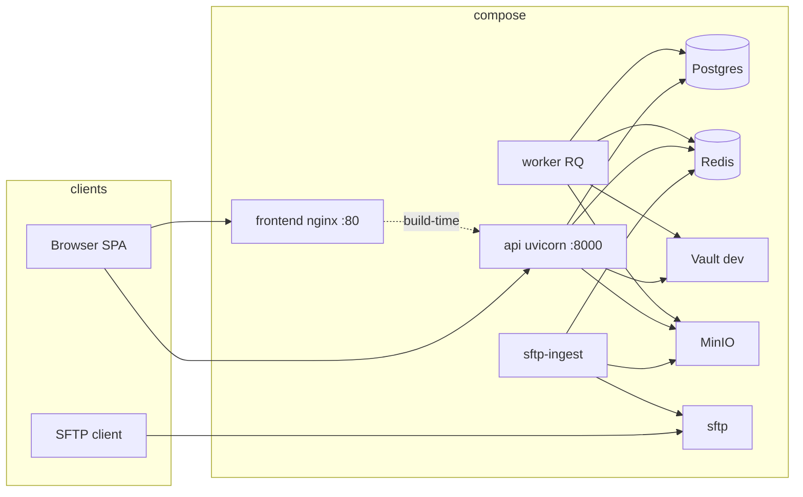

# Architecture (dropsort)

## Product

dropsort is a **local, Docker Compose–oriented** document classification service: TIFFs arrive via **SFTP** or **browser upload**, an **RQ worker** runs **ConvNeXt** inference, results land in **PostgreSQL** with overlays in **MinIO**, and **authenticated users** review outcomes through the **FastAPI** API and **React** SPA.

## Runtime topology

**Bring-up order (Compose):** infra (`db`, `redis`, `vault`, `minio`, `sftp`) becomes healthy → **`vault-seed`** writes KV secrets → **`migrate`** runs `alembic upgrade head` → **`api`**, **`worker`**, **`sftp-ingest`** start. **`frontend`** waits until **`api`** passes its Docker **healthcheck** (`GET /health` with `ok: true`).

Published **host** ports come from `.env` (see `.env.example`): `API_PORT` (default **8000**), `FRONTEND_PORT` (default **5173** → mapped to nginx **80** in the container).

## Layered backend

| Layer | Responsibility | Code |
|-------|------------------|------|
| **API** (`app/api/`) | HTTP, validation, Casbin-gated dependencies, response models. **No** ad-hoc SQLAlchemy queries in routers (healthcheck uses a tiny `SELECT 1` for dependency status only). | `batches.py`, `predictions.py`, `auth.py`, `admin.py`, … |
| **Services** (`app/services/`) | Business rules, **transactions** (`async with session.begin()`), **`FastAPICache.clear`** after writes. | `prediction_service.py`, `batch_service.py`, `user_service.py`, … |
| **Repositories** (`app/repositories/`) | SQLAlchemy **read/write** only; no cache, no Vault. | `*_repository.py` |
| **Infra** (`app/infra/`, `app/core/`) | Casbin enforcer, RQ queue client, MinIO adapter, Vault resolution, settings. | `casbin/`, `queue.py`, `vault.py` |

**Classifier:** `app/classifier/classify.py` loads **ConvNeXt Tiny** weights from `app/classifier/models/classifier.pt` (Git LFS). `app/classifier/runtime.py` adapts output for workers. **Boot checks** (`app/classifier/boot_checks.py`) enforce weights presence, SHA match to `model_card.json`, and optional **`MIN_MODEL_TOP1`** threshold (API + worker).

## Authentication and RBAC

- **fastapi-users** with **JWT** bearer transport (`POST /auth/jwt/login`). Signing key from Vault path `secret/jwt` (`signing_key`).
- **Casbin** (`app/infra/casbin/model.conf`) with PostgreSQL adapter; policies seeded in Alembic revisions (e.g. `0002`, `0005` for `/batches/upload`).

## Secrets

All runtime secrets for the API and workers are read once from **Vault KV v2** mount `secret/` via `app/core/vault.py` (`resolve_secrets`). Paths written by **`scripts/vault-seed.sh`** (Compose `vault-seed` service):

| Path | Keys |
|------|------|
| `secret/admin/initial_password` | `value` — used by Alembic `0002` to hash the initial admin user |
| `secret/jwt` | `signing_key` |
| `secret/postgres` | `url` (`postgresql+asyncpg://…@db:5432/dropsort`) |
| `secret/redis` | `url` |
| `secret/minio` | `root_user`, `root_password` |
| `secret/sftp` | `user`, `password` |

MinIO **endpoint and bucket** for the Python adapters also come from **Pydantic settings** / compose env (`MINIO_*`), aligned with the Vault values above.

## CI (GitHub Actions)

Workflow `.github/workflows/ci.yml`:

1. **Backend** — `ruff`, `mypy`, `pytest` on `tests/`, **`pytest app/classifier/eval/golden.py`**, grep gate (no literal `password` in `app/` except `vault.py`).
2. **Docker API** — `docker build -f Dockerfile .` (requires **Git LFS** checkout for `*.pt`).
3. **Compose smoke** — `scripts/ci_smoke.sh`: build API image, `docker compose up` core services, wait for `/health`, JWT login, TIFF upload, poll `/predictions/recent`.
4. **Frontend** — `npm ci`, `typecheck`, `build` with `VITE_API_BASE_URL`.

## Related documents

- [DECISIONS.md](./DECISIONS.md) — ADRs.
- [RUNBOOK.md](./RUNBOOK.md) — first-time run and demos.
- [SECURITY.md](./SECURITY.md) — secrets and review posture.
- [LICENSES.md](./LICENSES.md) — dataset and third-party notices.
